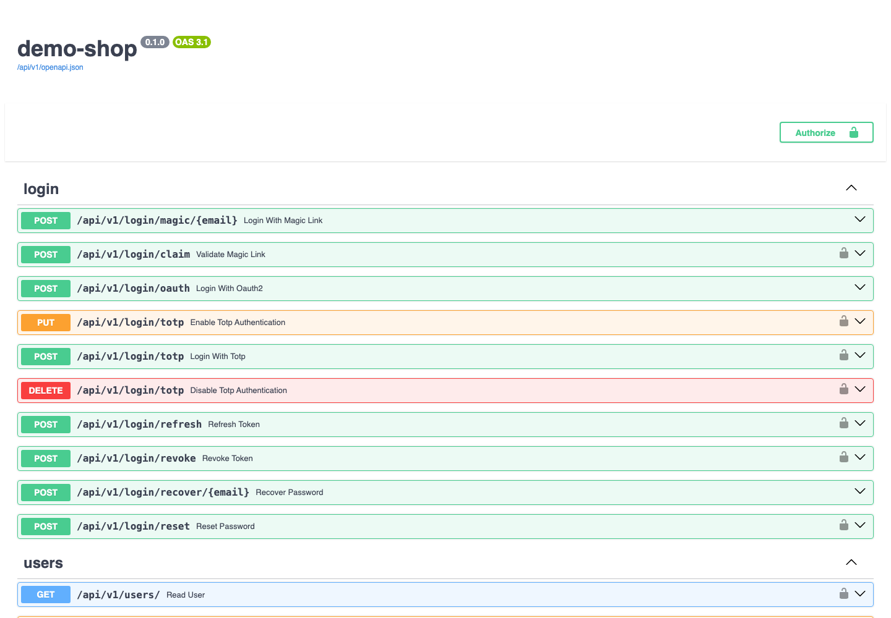

# create-mongo-app

Scaffold a full-stack FastAPI + MongoDB application from a single command.

The generated app ships an interactive API (Swagger UI) out of the box:



## Install

```bash
pip install create-mongo-app
```

## Usage

Create a new project (prompts for the remaining template values, with sensible
defaults):

```bash
create-mongo-app my-app
```

Accept all defaults without prompting:

```bash
create-mongo-app my-app --yes
```

Override individual template variables:

```bash
create-mongo-app my-app --yes \
    --set mongodb_database=mydb \
    --set first_superuser=admin@example.com
```

### Options

| Option | Description |
| --- | --- |
| `project_name` | Name of the project (also the directory name). |
| `-d`, `--directory` | Parent directory to create the project in (default: current dir). |
| `-y`, `--yes` | Accept all template defaults without prompting. |
| `-s`, `--set KEY=VALUE` | Override a template variable (repeatable). |
| `--overwrite` | Overwrite the target directory if it already exists. |
| `-V`, `--version` | Show version and exit. |

## What you get

The generated project is the full-stack-fastapi-mongodb layout:

- **backend/** — FastAPI app with MongoDB (PyMongo async driver), auth, Celery worker
- **frontend/** — Next.js frontend
- **docker-compose** — MongoDB, backend, frontend, Traefik, Flower

See the generated `README.md` for how to run it.

## Development

```bash
pip install -e ".[dev]"
pytest
```

The template lives, unmodified, under
`src/create_mongo_app/template/` (a standard cookiecutter directory). To update
it, re-vendor from upstream full-stack-fastapi-mongodb.

## License

MIT
